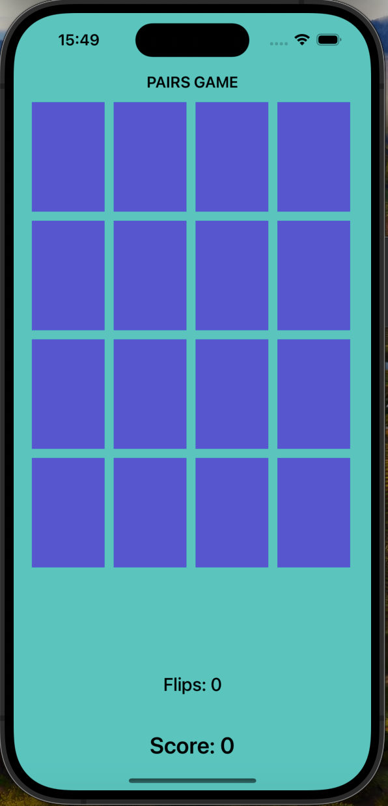
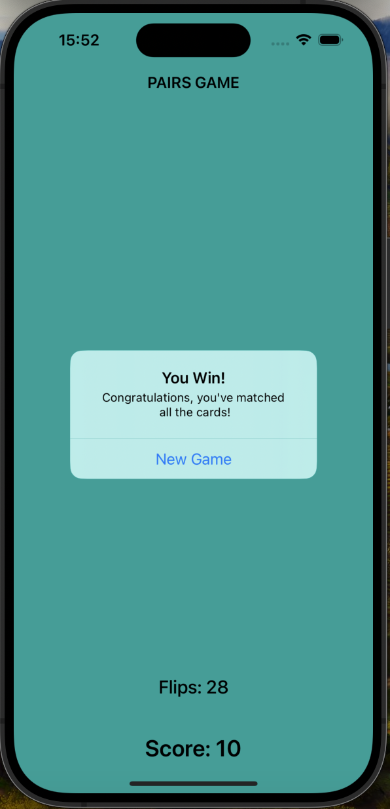

# Pairs Game

Pairs Game, a classic memory card game where players flip over cards to find matching pairs. This project is built using Swift and UIKit for iOS devices.

## Table of Contents

- [Features](#features)
- [Screenshots](#screenshots)
- [Requirements](#requirements)
- [Usage](#usage)
- [Code Overview](#code-overview)
  - [Model](#model)
  - [View](#view)
  - [Controller](#controller)
- [Possible Improvements](#possible-improvements)

## Features

- Flip cards to reveal emojis.
- Match pairs of cards to score points.
- Mismatched cards will flip back after a short delay.
- Displays the number of flips and the current score.
- Shows a "You Win!" message when all pairs are matched.
- Option to start a new game after winning.

## Screenshots

  
   
  <em>Game Start Screen</em>

  
   
  <em>Card Flipped</em>

  
   
  <em>Winning Screen</em>

## Requirements

- iOS 12.0+
- Xcode 12.0+
- Swift 5.0+

## Usage

1. Launch the app.
2. Tap on a card to flip it and reveal an emoji.
3. Tap on another card to find its match.
4. If the cards match, they will remain face up, and you will score points.
5. If the cards do not match, they will flip back down after a short delay.
6. Continue until all pairs are matched.
7. A "You Win!" message will appear once all pairs are matched, with an option to start a new game.

## Code Overview

### Model

- **Card.swift**: Defines the `Card` struct, representing a single card in the game.
- **Pairing.swift**: Contains the `Pairing` class, which manages the game logic, including card matching and score keeping.

### View

- **Main.storyboard**: The storyboard file defining the user interface, including card buttons, flip count label, and score label.

### Controller

- **ViewController.swift**: Manages the game flow and user interactions. Updates the view based on the game state and handles card flipping, matching, and scoring.

## Possible Improvements

- Add different difficulty levels with more pairs of cards.
- Implement animations for card flips and matches.
- Add sound effects for card flips and matches.
- Track high scores and display them on a leaderboard.
- Add a timer to challenge players to match pairs quickly.

